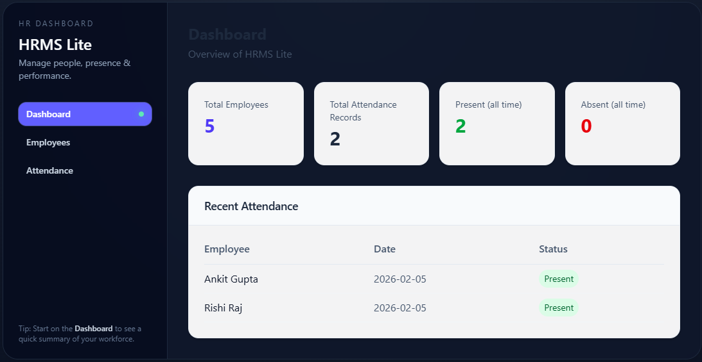

# HRMS Lite



A lightweight Human Resource Management System for managing employee records and daily attendance.

## Features

- **Employee Management**: Add, view, and delete employees (Employee ID, Full Name, Email, Department)
- **Attendance Management**: Mark daily attendance (Present/Absent) and view records
- **Dashboard**: Summary overview with counts and recent attendance
- **Filter attendance** by date and employee ID

## Tech Stack

- **Frontend**: React 19, Vite, Tailwind CSS
- **Backend**: Node.js, Express
- **Database**: SQLite (better-sqlite3)

## Prerequisites

- Node.js 18+ 
- npm

## Running Locally

### 1. Clone the repository

```bash
git clone <repository-url>
cd hrms-lite
```

### 2. Backend setup

```bash
cd backend
npm install
node src/db/init.js   # Initialize database
npm run dev           # Start API on http://localhost:5000
```

### 3. Frontend setup (in a new terminal)

```bash
cd frontend
npm install
npm run dev           # Start app on http://localhost:5173
```

The frontend proxies `/api` to the backend during development.

### 4. Production build

```bash
# Backend
cd backend && npm start

# Frontend
cd frontend && npm run build
# Serve the dist/ folder with any static file server
```

## API Endpoints

| Method | Endpoint | Description |
|--------|----------|-------------|
| GET | /api/health | Health check |
| GET | /api/employees | List all employees |
| POST | /api/employees | Add employee |
| DELETE | /api/employees/:id | Delete employee |
| GET | /api/attendance | List attendance (query: employee_id, date) |
| GET | /api/attendance/employee/:id | Attendance by employee |
| GET | /api/attendance/stats/:id | Present/absent stats |
| POST | /api/attendance | Mark attendance |

## Environment Variables

- `PORT` – Backend port (default: 5000)
- `DATABASE_PATH` – Path to SQLite DB file (default: ./hrms.db)
- `VITE_API_URL` – Frontend API base URL (for production, set to backend URL)

## Assumptions & Limitations

- Single admin user (no authentication)
- Leave management, payroll, and advanced HR features are out of scope
- SQLite file-based storage; for production at scale, consider PostgreSQL
- On ephemeral hosting (e.g. Render free tier), database resets on redeploy unless using external DB

## Deployment

### Backend (Render)

1. Create a new Web Service on [Render](https://render.com)
2. Connect your GitHub repo
3. Root directory: `backend`
4. Build: `npm install`
5. Start: `npm start`
6. Copy the deployed URL (e.g. `https://hrms-lite-api.onrender.com`)

### Frontend (Vercel)

1. Create a new project on [Vercel](https://vercel.com)
2. Connect your GitHub repo
3. Root directory: `frontend`
4. Add environment variable: `VITE_API_URL` = your backend URL (e.g. `https://hrms-lite-api.onrender.com/api`)
5. Deploy

### Note

On Render's free tier, SQLite data resets on redeploy (ephemeral filesystem). For production, use an external database (Neon PostgreSQL, Turso, etc.).
